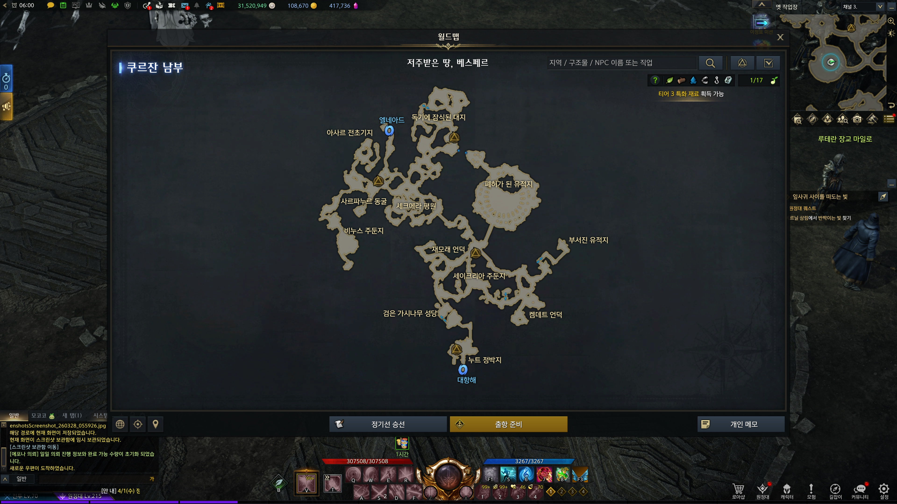
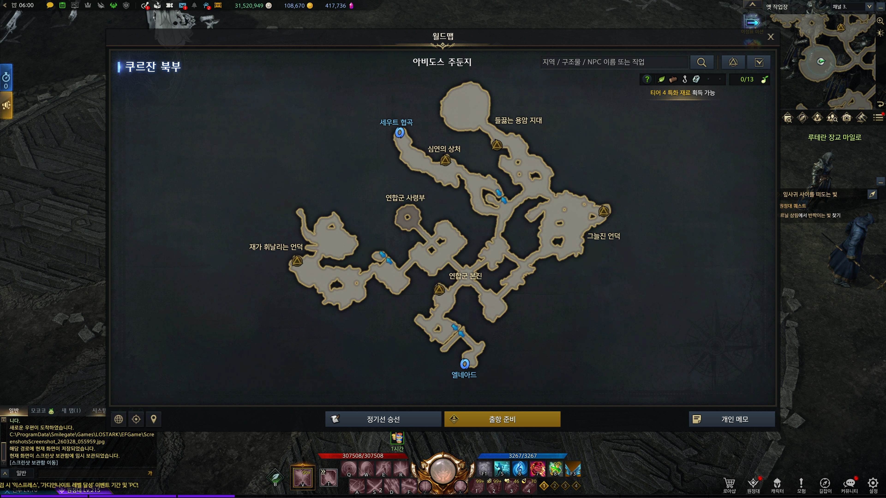
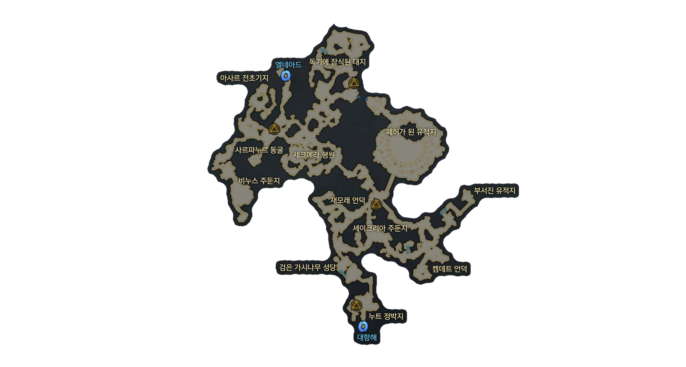
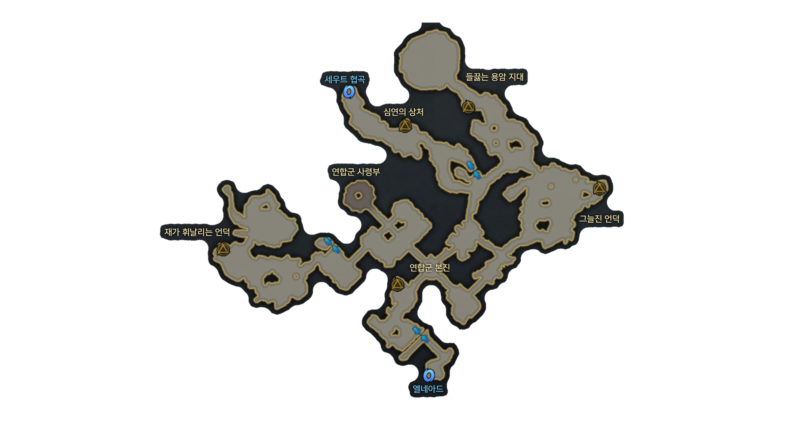

# Lost Ark Map Terrain Extractor

Extracts map terrain from Lost Ark world map screenshots, removing the dark background and UI elements to produce transparent PNG images.

## How It Works

1. **Crop** — Cuts the map window from the screenshot using fixed coordinates (3840x2160 resolution)
2. **Barrier Detection** — Identifies bright terrain outlines (V > 80 in HSV) as flood fill barriers
3. **Flood Fill** — Fills from image borders through dark areas; everything inside the barrier (terrain) is preserved
4. **Hole Filling** — Fills internal transparent holes caused by barrier gaps
5. **UI Cleanup** — Removes fixed UI elements (search bar, region labels, icons) and small edge components

## Requirements

- Python 3.8+
- OpenCV
- NumPy

## Setup

```bash
python -m venv .venv
source .venv/bin/activate
pip install -r requirements.txt
```

## Usage

```bash
# Single file
python src/extract_map.py input/screenshot.jpg

# Single file with custom output path
python src/extract_map.py input/screenshot.jpg -o output/map.png

# All images in a folder
python src/extract_map.py input/

# Debug mode (saves intermediate images)
python src/extract_map.py input/screenshot.jpg --debug
```

## Crop Coordinate Testing

Use `test_crop.py` to find the right crop coordinates for your resolution:

```bash
python tools/test_crop.py input/screenshot.jpg
python tools/test_crop.py input/screenshot.jpg --x1 500 --y1 250 --x2 3300 --y2 1750
```

## Configuration

Key parameters in `src/extract_map.py`:

| Parameter | Default | Description |
|-----------|---------|-------------|
| `MAP_WINDOW` | `(500, 250, 3300, 1750)` | Crop coordinates for 3840x2160 |
| `V > 80` | Step 1 | Brightness threshold for terrain outline barrier |
| `dilate(9,9) x4` | Step 1 | Barrier expansion to close outline gaps |
| `close(61,61)` | Step 1 | Morphological close to seal remaining gaps |

## Example

### Input
|  |  |
|:---:|:---:|

### Output
|  |  |
|:---:|:---:|

## Input / Output

- **Input**: Lost Ark world map screenshots (3840x2160 JPG recommended)
- **Output**: Transparent PNG with only map terrain preserved

Place screenshots in `input/` and results appear in `output/`.
